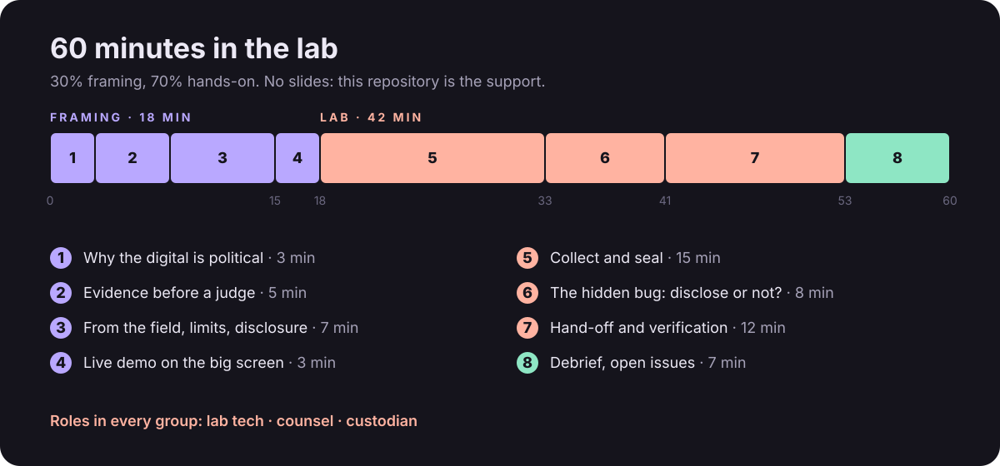
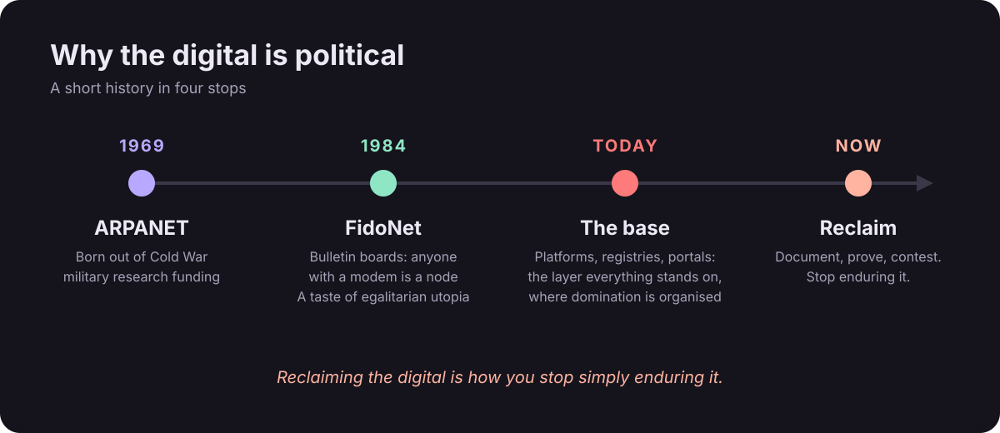
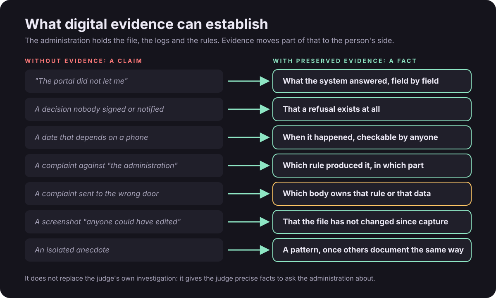
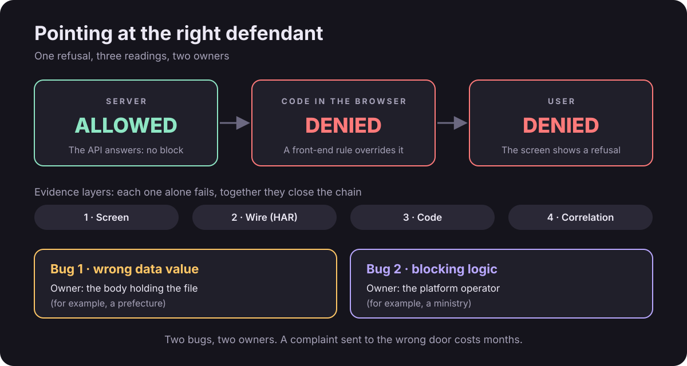
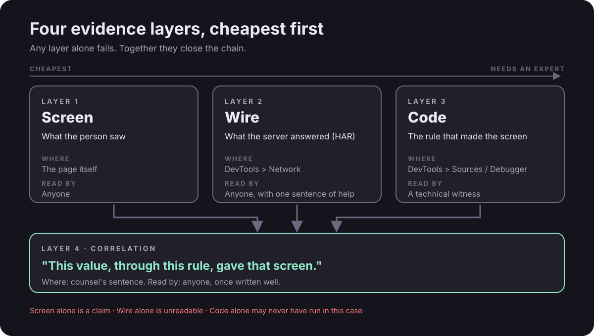
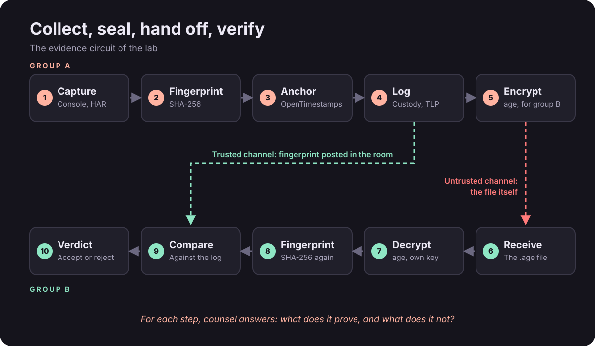
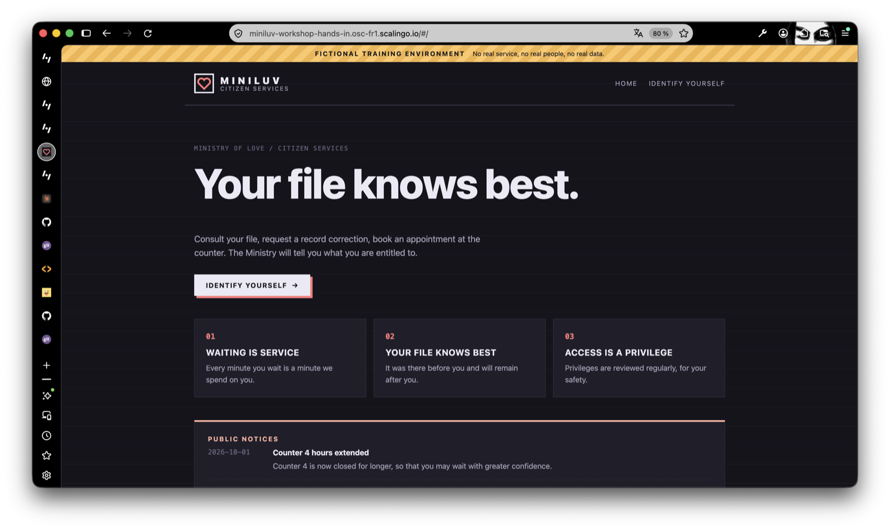
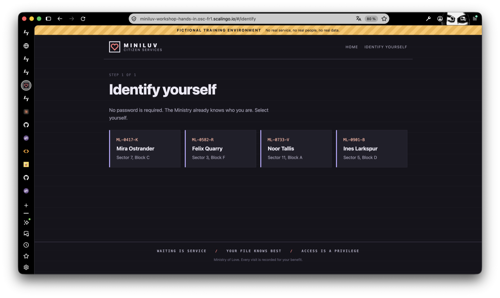
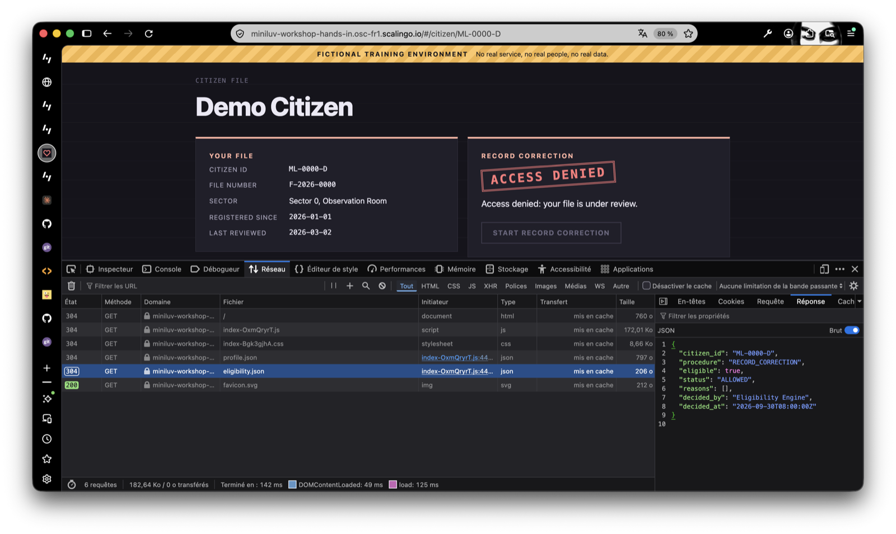

# Borrowed from the Lab
## Workshop support


> [!TIP] TL;DR
> **Cybersecurity methods for evidence management in strategic litigation.**
>
> **Why the digital is political**
>
> The network was born out of Cold War military research. In the eighties, FidoNet and the bulletin boards offered a glimpse of an egalitarian network, where anyone with a modem could be a node. Since then, digital infrastructure has become the base on which everything else stands, and through which domination is organised.
>
> At Urgence Homophobie, in Marseille, we support LGBTQIA+ people in migration. For them, registries, portals and platforms are where the harm actually happens: a refused correction, an appointment that never appears, a file that says no without saying why. Reclaiming the digital means documenting, proving and contesting it.
>
> **The problem**
>
> More and more administrative decisions are taken, or blocked, by a platform. What reaches the judge is usually a screenshot: no checkable date, no trace of what the system actually answered, and nothing that says who is responsible.
>
> Judges are not geeks, and they should not have to be. Our job is to be technical and pedagogical at the same time: show where a right is blocked and which administration is responsible, so the right body ends up as defendant. There are no explicit admissibility criteria for this kind of evidence yet. We are partly writing the spec as we go.
>
> **What we borrow from the lab**
>
> Cybersecurity practitioners have long handled exactly this kind of material. We hand over five of their methods, reframed for legal practice:
>
> - **Traffic Light Protocol**: who may receive what, across a coalition.
> - **SHA-256 fingerprints**: proof that a file has not changed by a single byte.
> - **OpenTimestamps**: proof that it existed at a given time, without disclosing its content.
> - **age encryption**: only the intended recipient can read it.
> - **Chain of custody**: who held it, when, and what they did.
>
> Each one is read through three questions: what problem does it solve, how do you apply it, and what does it look like before a judge. And each one comes with its limits: we work passively, in our own sessions only, and we say what we cannot see.
>
> **The lab**
>
> Two thirds of the session is hands-on. Miniluv Citizen Services, a fictional portal of Orwell's Ministry of Love, runs on a real server. Its citizens are being refused. In mixed-hub groups of lab tech, counsel and custodian, you open the browser's developer tools, compare what the screen says with what the server answered, seal the evidence, and hand it to another group, who must verify it before trusting it. Somewhere, the portal also shows more than it should. What you do about that is part of the exercise.
>
> No technical experience is needed. Every group needs someone who reads code and someone who reads law.
>
> **What you leave with**
>
> No slides. Everything lives in an open repository: support, participant workbook, wiki and templates, to reuse in your own cases.
>
> The point is not to turn lawyers into hackers. It is to make sure that when a system denies someone a right, the denial can be shown, understood, and sent to the right door.

<https://framagit.org/caffe-doppio/gathering-lab>

{width=240px}

Participant material : [`workbook/README.md`](../workbook/README.md)
Portal [Miniluv Citizen Services](<https://miniluv-workshop-hands-in.osc-fr1.scalingo.io/#/>)

> Cybersecurity methods for evidence management in strategic litigation.

---

## 0. How this session works



- **No slides.** This repository is the support, and you can take it home. Everything said in the room is written here or in the [workbook](../workbook/README.md).
- **Mixed-hub groups**, 3 to 5 people.
- **Three roles** in every group ([Roles](../workbook/wiki/share-roles.md)):
  - **Lab tech**: runs the browser and the terminal.
  - **Counsel**: says what the evidence proves, and what it does not.
  - **Custodian**: keeps the custody log. Nobody touches a piece without writing it down.
- **No technical experience needed.** Counsel and Custodian are made for people who have never opened DevTools. The tool does not decide what matters: people do.
- **Every method is read through three questions**, the same ones as in the session proposal:
  1. What problem does it solve?
  2. How do you apply it?
  3. What does it look like before a judge?

---

## 1. Why the digital is political



- **Origins.** The network was born out of Cold War military research. It was built to survive, not to be fair.
- **The utopia.** In the eighties, FidoNet and the bulletin boards gave a taste of an egalitarian network: anyone with a modem could be a node, relay messages, host a community.
- **The base.** Since then, digital infrastructure has become the base, in Marx's sense: the layer everything else stands on, and through which domination is organised.
- **Where the harm happens.** For LGBTQIA+ people in migration, registries, portals and platforms are not a side issue. A residence permit, an appointment, a correction of one's own civil data: each goes through a screen that can say no without explaining why.
- **Reclaiming it.** Reclaiming the digital means documenting, proving and contesting. It is how you stop simply enduring it.

> [!NOTE] Takeaway for the room:
> the methods in this session are not neutral techniques. They are a way of making a machine's decision visible to the people it affects, and to the judge who reviews it.

---

## 2. The problem: digital evidence before an administrative judge

- **Decisions move into software.** More and more administrative decisions are taken, or blocked, by a platform. Often nobody signed them: a rule in the code did.
- **What reaches the judge: a screenshot.** A screenshot shows what someone saw. It does not show what the system actually answered, it carries no date anyone can check, and it can be edited in seconds.
- **Judges are not geeks, and they should not have to be.** The burden is on us to translate, not on them to learn DevTools.
- **Our role: technical and pedagogical at the same time**, without imposing a reading on the magistrate. We bring facts the judge can check, and one sentence that explains them.
- **The goal: point at the right door.** Show **where** a right is blocked, and **which administration** is responsible, so the right body ends up as defendant. A complaint sent to the wrong body can cost months.

> [!TIP] No spec yet
> In the proceedings we work on, there are no explicit admissibility criteria for this kind of evidence. We are partly writing the spec as we go, which is also why sharing methods across hubs matters.

Administrative justice has long rested on an imbalance: the administration holds the file, the logs and the rules, and the person holds a refusal. Well-preserved digital evidence moves part of that knowledge to the person's side of the table.



> [!NOTE] What it does not do:
> replace the judge's own investigation. It gives the judge precise facts to ask the administration about.

---

## 3. From the field



- **The case pattern.** A national online portal refused access to the very procedure used to correct one's own data.
- **Three readings of one event:**
  - The **server** said: allowed.
  - The **code in the browser** said: denied.
  - The **user** saw: denied.
- **Two bugs, two owners.** A wrong data value held by one body, and a blocking rule owned by another. Without the evidence chain, both complaints go to the same wrong address.
- **Four evidence layers, cheapest first** ([Evidence layers](../workbook/wiki/frame-evidence-layers.md)):



- **Any layer alone fails.** A screenshot alone is a claim. A HAR alone is unreadable. Code alone is a rule that may never have run in this case. Together they close the chain.
- **Asking for the code.** Many public portals publish their source code. In France, source code held by an administration is a communicable administrative document (CRPA art. L. 300-2), and a person subject to an algorithmic individual decision can ask for its rules (CRPA art. L. 311-3-1). Published code is **a** version: only the timestamped capture shows what ran that day.
- **Same reasoning elsewhere.** Online appointment booking, where people can lose access to the queue itself, leaves the same kind of traces.

> [!NOTE]
> Cases are presented orally. Only patterns are published here, pending coordinated disclosure.

---

## 4. Honest limits

- **Passive only** ([Passive only](../workbook/wiki/frame-passive-only.md)). Your own session, your own file, what a normal browser loads. No scanning, no probing, no fuzzing, no guessing other addresses or other people's identifiers. In France, unauthorised access to an automated data processing system is an offence (Penal Code, art. 323-1).
- **What passive cannot see.** Server-side logic, other users, other paths. Do not claim it. Writing down what you cannot claim is part of the evidence.
- **One file is a finding, not a statistic.** Scope beyond the observed case stays a hypothesis until other cases are documented the same way.
- **A timestamp is not a presumption.** OpenTimestamps is not a qualified electronic timestamp under eIDAS (Regulation (EU) No 910/2014, art. 41). It is admissible, but its weight must be explained to the judge, it is not presumed.
- **The disclosure dilemma** ([Hidden bug and disclosure](../workbook/wiki/frame-disclosure.md)). You find a vulnerability in the very service you want to take to court:
  - Do not exploit it.
  - Do not sit on it: users are exposed.
  - Timestamp what you observed, disclose it responsibly to the operator (`/.well-known/security.txt` says who to contact), keep the case about the rights, not the bug.
  - Timestamping is what lets your evidence survive the patch.

---

## 5. The instruments

Each instrument answers one narrow question. Their strength is in the combination, and in being honest about what each one does **not** prove.

### Traffic Light Protocol (TLP 2.0, FIRST)

**What it is.** A set of five labels, maintained by FIRST, that tells every recipient how far a piece of information may travel. You put the label on the piece; whoever receives it follows the rule of that colour.

**Problem it solves.** In a coalition, a piece of evidence passes through many hands. Without a label, nobody knows who may see it, and the most cautious person stops sharing at all.

-  Named recipients only, no further sharing.
-  The recipient's organisation only.
-  The recipient's organisation, and those who need to know to act on it.
-  The community, not public channels.
-  Anyone.

**How.** Label **every** piece and every document, at the top, in words. Unlabelled means nobody knows who may see it. In a coalition, the label travels with the piece, not with the person.

```text
TLP:AMBER+STRICT
Subject: HAR capture, citizen ML-0000-D, 2026-10-07 15:38 CEST
Shared with: Urgence Homophobie legal team only
```

**Before a judge:** TLP is internal discipline, not a legal category. It shows the court that sensitive material was handled with care, which matters when personal data is involved.

Wiki: [TLP](../workbook/wiki/share-tlp.md). Badges: [`assets/badges-tlp/`](../assets/badges-tlp/).

### SHA-256 fingerprint

**What it is.** A short, fixed-length code computed from every byte of a file, like a fingerprint for data. Change a single letter in the file and the code changes completely, so two people can check they hold the same file by comparing 64 characters.

**Problem.** "Is this the same file I gave you?" A file can change without anyone noticing.

```console
$ shasum -a 256 group2_ML-0000-D_20261007-1538.har
3f2a9c0e7b1d4a8e6f5c2b9a0d7e3c1f8b4a6e2d9c0f7a3b5e1d8c4a2f6b9e0d  group2_ML-0000-D_20261007-1538.har
```

Read it aloud as the first 8 and last 8 characters: `3f2a9c0e ... 2f6b9e0d`.

**Before a judge:** "If anyone had modified this file, even by one letter, this number would be different. Anyone can recompute it."

Wiki: [SHA-256](../workbook/wiki/seal-sha256.md).

### OpenTimestamps anchor

**What it is.** A free, open protocol that writes a file's fingerprint into the Bitcoin blockchain, a public ledger nobody can rewrite. Only the fingerprint leaves your computer, so you can later prove the file existed at that date without ever having disclosed it.

**Problem.** "When did this exist?" A screenshot's date is whatever the device said.

```console
$ ots stamp group2_ML-0000-D_20261007-1538.har
$ ls
group2_ML-0000-D_20261007-1538.har
group2_ML-0000-D_20261007-1538.har.ots

$ ots verify group2_ML-0000-D_20261007-1538.har.ots
# right after stamping: the anchor is pending, confirmation takes a few hours
# once confirmed: a Bitcoin block attests existence as of a given date
```

Keep the `.ots` file next to the evidence. Lose the `.ots`, lose the proof.

**Before a judge:** "This fingerprint was recorded in a public ledger that nobody can rewrite, no later than this date." Explain it, do not assume it (section 4).

Wiki: [OpenTimestamps](../workbook/wiki/seal-opentimestamps.md).

### age encryption

**What it is.** A small, modern encryption tool with two keys: a public key you can post on a wall, and a private key you never share. Anyone can lock a file with your public key; only your private key can open it.

**Problem.** Evidence often holds personal data and session tokens. Email and shared drives are not a safe way to move it.

```console
$ age-keygen -o group.key
Public key: age1ql3z7hjy54pw3hyww5ayyfg7zqgvc7w3j2elw8zmrj2kg5sfn9aqmcac8p

$ age -r age1THEIR_PUBLIC_KEY -o evidence.har.age evidence.har    # sender
$ age -d -i group.key -o received.har evidence.har.age             # recipient
$ shasum -a 256 received.har                                       # compare with the posted fingerprint
```

The public key above is an example. Post yours, never the `group.key` file.

**Before a judge:** shows the material was protected in transit. It says nothing about who sent it.

Wiki: [age encryption](../workbook/wiki/seal-age.md).

### Chain of custody

**What it is.** A log written at the moment, one line per action, that tells the story of a piece of evidence from capture to court. It follows the logic of ISO/IEC 27037: identify, collect, acquire, preserve.

**Problem.** "Who held this, and what did they do with it?" Gaps in that story are where the other side attacks.

```text
# | Time       | Who              | Action      | Piece                              | SHA-256             | TLP   | Note
3 | 15:40 CEST | Amira (Lab tech) | Fingerprint | group2_ML-0000-D_20261007-1538.har | 3f2a9c0e ... 2f6b9e0d | AMBER |
4 | 15:42 CEST | Amira (Lab tech) | Anchored    | group2_ML-0000-D_20261007-1538.har | 3f2a9c0e ... 2f6b9e0d | AMBER | ots stamp, pending
```

**Before a judge:** the log is the story of the evidence, told in order, checkable line by line.

Wiki: [Custody log](../workbook/wiki/share-custody-log.md) (template inside).

### What each instrument proves, and what it does not

| Instrument | Proves | Does not prove |
|------------|--------|----------------|
| SHA-256 fingerprint | The file has not changed by a single byte | Who made it, or when |
| OpenTimestamps anchor | The fingerprint existed at a given time | What the file means |
| age encryption | Only the recipient can read it | Who sent it |
| Custody log | Who held it, when, and what they did | That the log itself is honest, unless it is checked |
| TLP label | Who may receive it | Anything about the content |

---

## 6. The lab: Miniluv Citizen Services



### Welcome to the Ministry

*The Ministry of Love has opened a citizen portal.*

Its front page greets you with a promise: **"Your file knows best."** Three principles follow, in large friendly tiles: *Waiting is service. Your file knows best. Access is a privilege.* Below them, public notices reassure you that Counter 4 is now closed for longer, "so that you may wait with greater confidence", and that corrections are welcome: "your file will tell you if you need one."



You click **Identify yourself**. Four citizens are waiting. Each one asked the Ministry for something simple: to correct their own file, or to see an officer at the counter. Each one was refused, politely, in red.



The portal is courteous. It is also talkative: open the browser's Console and the Ministry speaks to you, thanking you for your patience and reviewing contents "on your behalf". And it sends more than it shows.

*Citizens are being refused. Your lab has been asked to document it.*

Miniluv is fictional, straight out of Orwell, and runs on a real server. Every citizen and every value is synthetic. Participants follow [`workbook/README.md`](../workbook/README.md), then their persona sheet, phase by phase.

<details>
<summary>Personas</summary>

| Persona | Level | Brief |
|---------|-------|-------|
| Mira Ostrander | Starter | The portal refuses a correction to Mira's own file |
| Felix Quarry | Starter | The portal shows no appointment, for weeks |
| Noor Tallis | Two problems in one file | Both refusals at once: are they the same kind of problem? |
| Ines Larkspur | Challenge | A refusal too. Saying "no case against the portal" is a valid answer, if proven |

Rule for the room: together, the groups cover **Mira or Noor** and **Felix or Noor**. Fast groups take a second persona, in a **new private window**.

</details>

<details>
<summary>Phase 4. Live demo (3 min)</summary>

The facilitator shows the method once on the big screen, on a demonstration citizen that no group uses:

1. Private window, DevTools open **before** loading the page, history kept.
2. The screen's refusal.
3. What the Console says.
4. What the server answered, in the Network tab.
5. Export, fingerprint, and verification of a pre-anchored timestamp.



</details>

### Phase 5. Collect and seal (15 min)

- Open DevTools **before** anything else ([DevTools](../workbook/wiki/browser-devtools.md)). Network tab:
  - Firefox: gear icon > **Persist Logs**.
  - Chrome: tick **Preserve log**.
- Reproduce the refusal. Copy the exact words on the screen.
- Read each request's answer ([Requests and JSON](../workbook/wiki/browser-requests-json.md)). Find the one that contradicts the screen, or prove none does.
- Counsel compares screen and wire: same story, or not? Who decided what the screen shows?
- Seal, one custody log line per step:
  1. Export the HAR ([Export a HAR](../workbook/wiki/browser-har.md)). Treat it as sensitive: in real life it holds session tokens and personal data.
  2. Fingerprint it.
  3. Anchor it. It stays pending: normal.
  4. Label it TLP. Which colour would a real capture deserve?
- Going further: find the display rule in DevTools > Sources / Debugger.

### Phase 6. The hidden bug (8 min)

- The portal sends more than it shows. Somewhere.
- Read every response, to the very end. Is there anything the citizen was never meant to see?
- Found it? **Stop there.** No other addresses, no other citizens.
- Decide as a group: what you do, who you tell, what you keep. Custodian logs the decision. Counsel explains it in two sentences.

### Phase 7. Hand-off and verification (12 min)

The facilitator sets a ring: each group sends to the next.

- **Send.** Generate your group key, post your public key (`age1...`) where everyone can see it, never the private key. Encrypt your HAR for the receiving group. Post its fingerprint in the room: a **different channel** than the file.
- **Receive.** Decrypt, fingerprint again, compare with what was posted.
- **Verdict:** accept or reject, in one sentence. Trust nothing you receive until you have checked it.

---

## 7. Cheat sheet

Full version with troubleshooting: [Terminal cheat sheet](../workbook/wiki/terminal-cheatsheet.md).

```sh
# Fingerprint
shasum -a 256 evidence.har                        # macOS
sha256sum evidence.har                            # Linux
certutil -hashfile evidence.har SHA256            # Windows (cmd)
Get-FileHash .\evidence.har -Algorithm SHA256     # Windows (PowerShell)

# Anchor in time
ots stamp evidence.har                            # creates evidence.har.ots
ots verify evidence.har.ots                       # once the anchor is confirmed

# Encrypt for another group
age-keygen -o group.key                           # prints your public key: age1...
age -r age1... -o evidence.har.age evidence.har   # encrypt for the recipient's key
age -d -i group.key -o evidence.har evidence.har.age   # decrypt with your own key
```

---

## 8. Debrief

<details>
<summary>Open after phase 7</summary>

Questions for the room, one group each, rotating hubs:

1. A group that found **no** contradiction: what did you prove? (Nothing wrong with the portal is a result.)
2. Counsel: who is the right defendant, in one sentence?
3. Counsel: what can you **not** claim from your capture?
4. What did you decide about the hidden bug, and who did you tell?
5. If you looked at the portal's published source code: what does it prove about what *this* citizen received on *that* day?

What to keep:

- Encryption protects confidentiality, not origin. Anyone holding your public key can encrypt a file for you.
- Integrity comes from the fingerprint, checked against a record that travelled through a different, trusted channel.
- Time comes from the anchor.
- Responsibility comes from the correlation: this value, through this rule, gave that screen.
- Question for counsel: which of these would a judge understand, and how would you say it in one sentence?

</details>

---

## 9. Contribute

- Open an issue: a case type from your hub, a template, a translation, a correction.
- The workbook stays online after the session. The methods work on any portal, as long as you stay passive and in your own session.

---

## 10. Resources

- TLP 2.0: https://www.first.org/tlp/
- OpenTimestamps: https://opentimestamps.org
- age: https://github.com/FiloSottile/age
- Miniluv source: https://github.com/caffe-doppio/dev-miniluv
- ISO/IEC 27037:2012, guidelines for identification, collection, acquisition and preservation of digital evidence
- Regulation (EU) No 910/2014 (eIDAS), art. 41
- Code des relations entre le public et l'administration, art. L. 300-2 and L. 311-3-1
